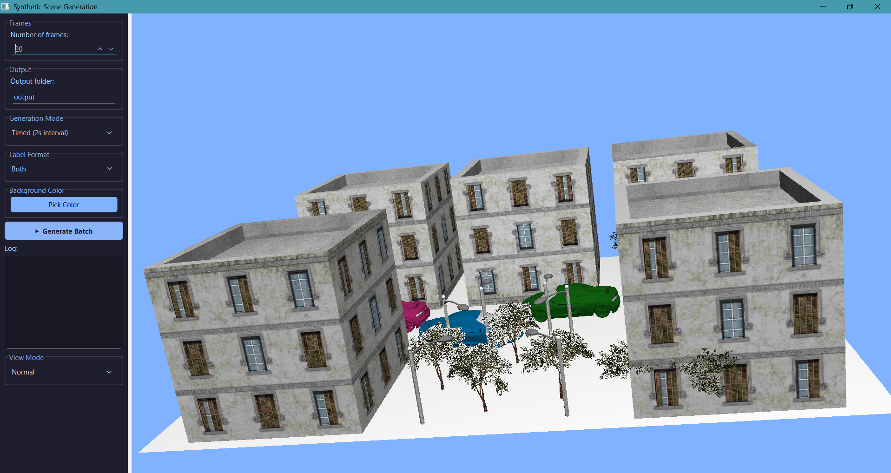
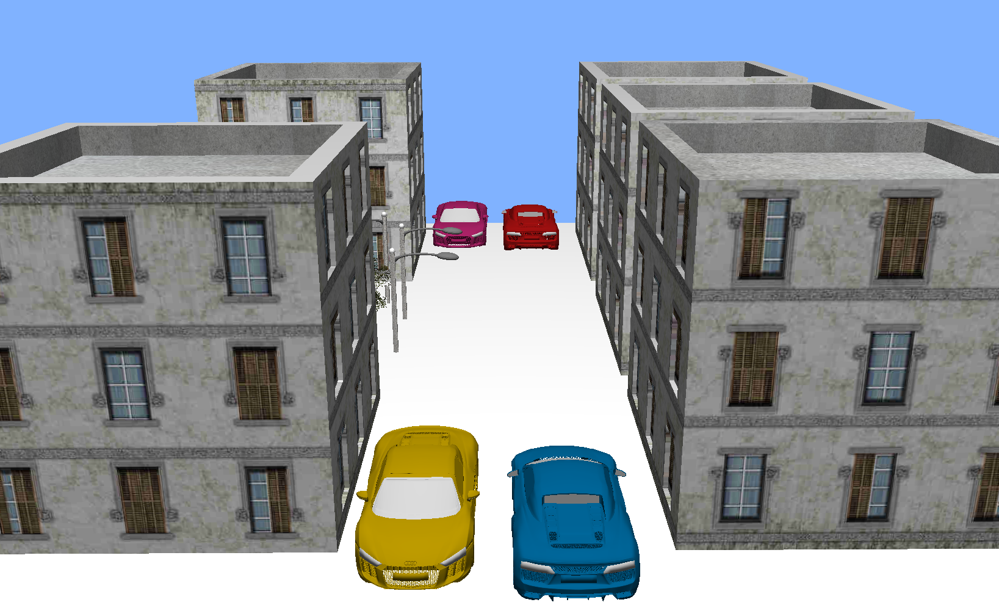
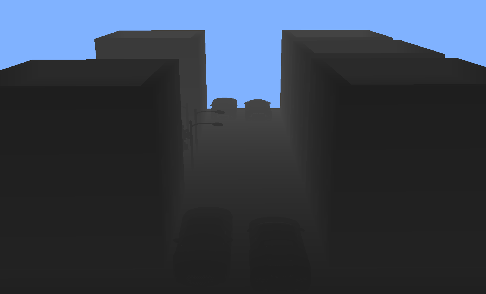
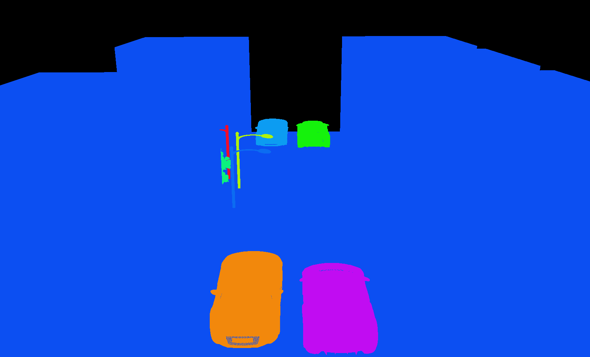
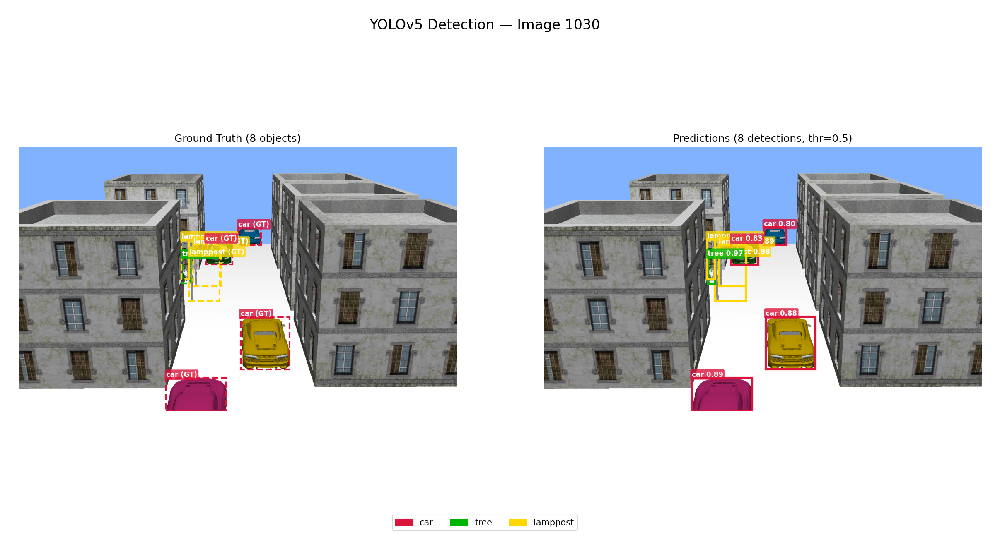
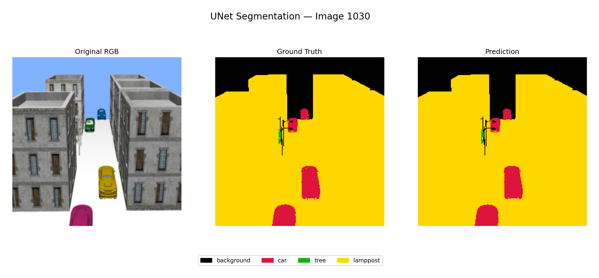

# Automatic Traffic Scene Image Dataset Generation System


This project builds an automatic synthetic data generation system. The system constructs a 3D scene (including buildings, vehicles, trees, and lampposts) using OpenGL, simulating realistic vehicle movement animations. Through this, the system renders various types of data including RGB images, Depth maps, and Instance Segmentation masks. From the mask, the system automatically extracts bounding boxes and exports labels in COCO and YOLO formats accurately (pixel-perfect), saving manual labeling time when preparing training data for AI models. The system also provides an intuitive user interface built with PyQt6 to directly monitor the inference and rendering process.

## Table of Contents
- [Project Directory Structure](#project-directory-structure)
- [How to Use](#how-to-use)
- [Data Results](#data-results)
  - [Origin Image](#origin-image)
  - [Depth Image](#depth-image)
  - [Segmentation Image](#segmentation-image)
  - [Extracted YOLO Label Sample](#extracted-yolo-label-sample)
- [Deep Learning Model Input Results](#deep-learning-model-input-results-srctestresult)
  - [Semantic Segmentation Results Comparison](#semantic-segmentation-results-comparison)
  - [Object Detection Results Comparison](#object-detection-results-comparison)
  - [YOLOv5](#yolov5)
  - [Unet](#unet)
  - [DeepLabV3](#deeplabv3)
- [LICENSE](#license)

## Project Directory Structure

```text
btl2/
├── assets/                  # Contains illustrative images for documentation
├── exporter/                # Exports YOLO and COCO labels from Segmentation Mask
├── libs/                    # Core libraries for transform and camera
├── models/                  # Post-processing pipeline integrating AI models
├── object/                  # Static 3D models (building, car, tree, lamppost)
├── output/                  # Contains generated output data (rgb, depth, mask, yolo, coco_annotations.json)
├── render/                  # OpenGL renderer managing render passes (RGB, Depth, Mask)
├── scene/                   # 3D scene management (object positions, animation controls)
├── shader/                  # GLSL shader source files (phong, depth, mask)
├── src/                     # Source code for evaluating deep learning models
│   └── test/
│       ├── results_deeplabv3/
│       ├── results_unet/
│       └── results_yolov5/
├── ui/                      # User Interface source code (PyQt6)
├── venv/                    # Virtual environment
└── main.py                  # Main application entry point
```

## How to Use

**1. Initialize the virtual environment and install dependencies:**
```bash
# Using virtual environment
python -m venv venv
.\venv\Scripts\Activate.ps1

# Install required libraries
pip install -r requirements.txt
```

**2. Run the application via the graphical interface (GUI):**
```bash
python main.py
```
In this mode, you can visually view the 3D scene, customize render settings, test Inference with models via the interface, and click the Generate button to export data to the `output/` folder.

**3. Run automatically (Headless Batch mode):**
To automatically generate a specific number of frames (e.g., 100 frames) without opening the graphical interface, use the `--headless` flag:
```bash
python main.py --headless --num-frames 100
```

## Data Results
### Origin Image

### Depth Image


### Segmentation Image


### Extracted YOLO Label Sample
Example content of a sample `0000.txt` file exported in `output/yolo/`:
```text
1 0.720831 0.565086 0.032987 0.090817
2 0.719609 0.558527 0.028100 0.172553
2 0.769090 0.599899 0.084301 0.204844
2 0.781307 0.565590 0.075748 0.168517
0 0.817349 0.576186 0.074527 0.084763
0 0.927306 0.833502 0.144166 0.209889
0 0.786805 0.678607 0.107514 0.130172
0 0.916616 0.644803 0.095907 0.115035
```
*(Column 1 is the class_id (0: Car, 1: Tree, 2: Lamppost), the following columns are the normalized x_center, y_center, width, and height coordinates `[0,1]`)*

## Deep Learning Model Input Results (`src/test/result*`)

The system provides a built-in pipeline to evaluate the quality of the generated dataset by testing with popular computer vision model architectures. Prediction results are stored at `src/test/`:

- **Object Detection Models:**
  - **YOLOv5** (Results at `src/test/results_yolov5/`)
  - **Faster R-CNN** (Update Later)
- **Semantic Segmentation Models:**
  - **UNet** (Results at `src/test/results_unet/`)
  - **DeepLabV3** (Results at `src/test/results_deeplabv3/`)

### Semantic Segmentation Results Comparison

| Metric | UNet (50 epochs) | DeepLabV3 (23 epochs)|
|---|---|---|
| Background IoU | **99.47%** | 91.22% |
| Car IoU | **90.84%** | 63.98% |
| Tree IoU | **92.36%** | 0.60% |
| Lamppost IoU | **99.81%** | 96.55% |
| **Mean IoU** | **95.62%** | 63.09% |
| **Pixel Accuracy** | **99.60%** | 96.76% |
| Inference Time | **77.8 ms/img** | 271.0 ms/img |

### Object Detection Results Comparison

| Metric | YOLOv5 (300 epochs) | Faster R-CNN (Update Later) |
|---|---|---|
| Precision | **92.11%** |  |
| Recall | **94.75%** |  |
| **mAP@0.5** | **90.83%** |  |
| **mAP@0.5:0.95** | **85.26%** |  |
| Inference Time | **175.2 ms/img** |  |

### YOLOv5

### Unet

### DeepLabV3


## LICENSE

The project is distributed under the .

